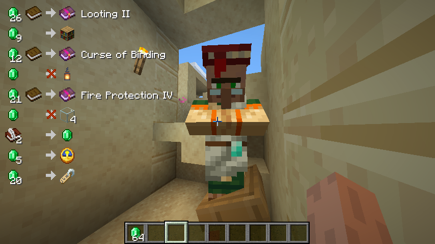

# OffersHUD

OffersHUD is a client-side mod which display a list of villager's trading offers as a HUD, without a right-click.

Supports both **Fabric** and **NeoForge**.

## Installation

### Download

The latest releases of OffersHUD are published to these services.

- [Modrinth](https://modrinth.com/mod/offershud)
- [GitHub Release](https://github.com/naari3/offers-hud/releases)
- [CurseForge](https://www.curseforge.com/minecraft/mc-mods/offershud)

### Required Mods

#### Fabric

- [Fabric API](https://modrinth.com/mod/fabric-api)
- [Cloth Config API](https://modrinth.com/mod/cloth-config)
- [Mod Menu](https://modrinth.com/mod/modmenu)

#### NeoForge

- [Cloth Config API](https://modrinth.com/mod/cloth-config)

## Features

### Main

When you focus on a villager with profession (or wandering trader), the offers will be displayed in the upper left corner of the screen.

This can be very useful, for example, for carefully selecting the details of a villager's trading offers.
You don't have to right-click on the villager every time you reposition the job site block.

### Configurations

Access the configuration screen from the Mods menu.

#### Enabled

- Toggle enabled / disabled
- default: **true**

#### Ignore villagers who do not have a profession

- Do not react to focus on villagers without profession.
- If false, try to interact with villagers who do not have a profession as well.
  - Mainly for special villagers on spigot servers, etc.
- default: **true**

#### Suppress villager head rolling

- Villagers will no longer do head rolling when interacting, even if no profession villagers.
  - Mainly for `Ignore villagers who do not have a profession: false`
- default: **false**

## Special Thanks

- @javascriptjp has done a great job with version 1.19!
